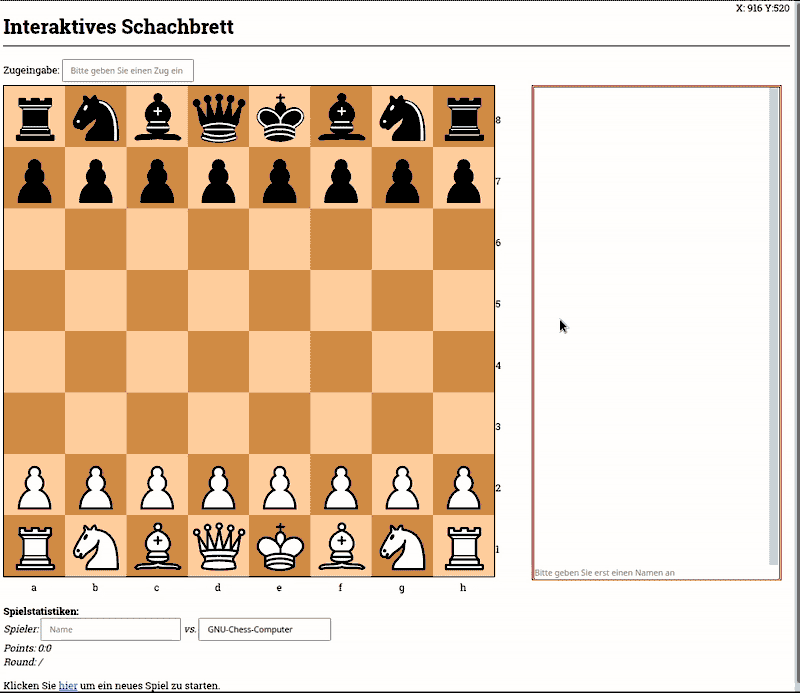

# Interaktives Schachbrett

## Überblick

Dieses Softwareprojekt besteht aus mehreren Teilen:

- einem HTML-Dokument, welches das Schachbrett darstellt und Eingaben entgegen nimmt,
- JavaScript-Code für das Setzen, Löschen und Verschieben von Figuren und der Verarbeitung und der Weitergabe von Eingaben,
- einigen CSS-Regeln für das Styling der Seite,
- sowie einem Python-CGI-Skript, welches die Zugüberprüfung vornimmt -- dieses bekommt die Stellungsübersicht über einen String in der [Forsyth-Edwards-Notation][1] übermittelt.

## Installation

1. Herunterladen des ZIP_Archivs
2. Entpacken des Archivs an einem beliebigen Punkt in ihrem Dateisystem
3. Stellen sie sicher das sie Python 3 installiert haben
4. Terminal öffnen und in den Ordner des Entpackten ZIP-Archivs wechseln
5. Per `python script.py` den lokalen Server starten
6. Sollte `Serving on port 8000...` als Output erscheinen, hat alles geklappt und sie können `http://localhost:8000` in ihrem Internetbrowser öffnen.

## Dokumentation

Zur besseren Vorstellung, an dieser Stelle eine kurze GIF-Animation einer Nutzerinteraktion:

- Die Zugeingabe kann sowohl über die Tastatur (in dem entsprechenden Eingabefeld) in einer leicht abgewandelten algebraischen Schachnotation erfolgen (Besonderheiten siehe unten) oder komfortabel über die Maus.
- Vorgelegte Züge werden von einem Python-Backend auf ihre Richtigkeit geprüft (derzeit bestehen noch kleine Einschränkungen)

### Algebraische Notation

Das Format der Tastatureingabe folgt im Prinzip der [algebraischen Notation][3]:

- Die zu ziehende Figur wird durch einen Buchstaben kodiert (der aus der englischen Bezeichnung abgeleitet ist):  

    - **P** = Pawn = Bauer
    - **R** = Rock = Turm
    - **N** = Knight = Springer
    - **B** = Bishop = Läufer
    - **K** = King = König
    - **Q** = Queen = Dame

- Kleinbuchstaben stehen dabei für schwarze Figuren und Großbuchstaben für weiße Figuren

- Es folgt die derzeitige Koordinate der Figur, z.B.:  **a2**

- Dann folgt die Zielkoordinate, also z.B. **a3**  

Im ganzem könnte ein Zug bspw. für den weißen Bauern von Feld a2 zu a3 so aussehen: **Pa2a3**

## Derzeitige Einschränkungen bei der Zugüberprüfung

Noch nicht implementiert sind zur Zeit:

- En-passant-Schlagen des Bauern
- Umwandlung des Bauerns auf der gegnerischen Grundreihe ist noch nicht implementiert
- Rochaden
- Prüfung der Stellungswiederholung
- Matt-Erkennung

## To-Do-Liste

- Speicherung der getätigten Zugfolgen in der [Portable Game Notation][4]
- das Pythonskript soll den Nutzer-Zug durch das [Universal Chess Interface][5] an ein geeignetes Schachprogramm weitergeben.

Bei UCI (Universal Chess Interface) handelt es sich um ein Kommunikationsprotokoll für Schachprogramme, welches zum Beispiel von [GNU Chess][6] beherrscht wird.

Letztlich möchte ich selbst ein Schachprogramm implementieren und das interaktive Schachbrett soll mir die Kommunikation damit ermöglichen.

[1]: https://de.wikipedia.org/wiki/Forsyth-Edwards-Notation
[3]: https://de.wikipedia.org/wiki/Schachnotation#Algebraische_Notation
[4]: https://de.wikipedia.org/wiki/Schachnotation#Portable_Game_Notation
[5]: https://de.wikipedia.org/wiki/Universal_Chess_Interface
[6]: https://de.wikipedia.org/wiki/GNU_Chess
